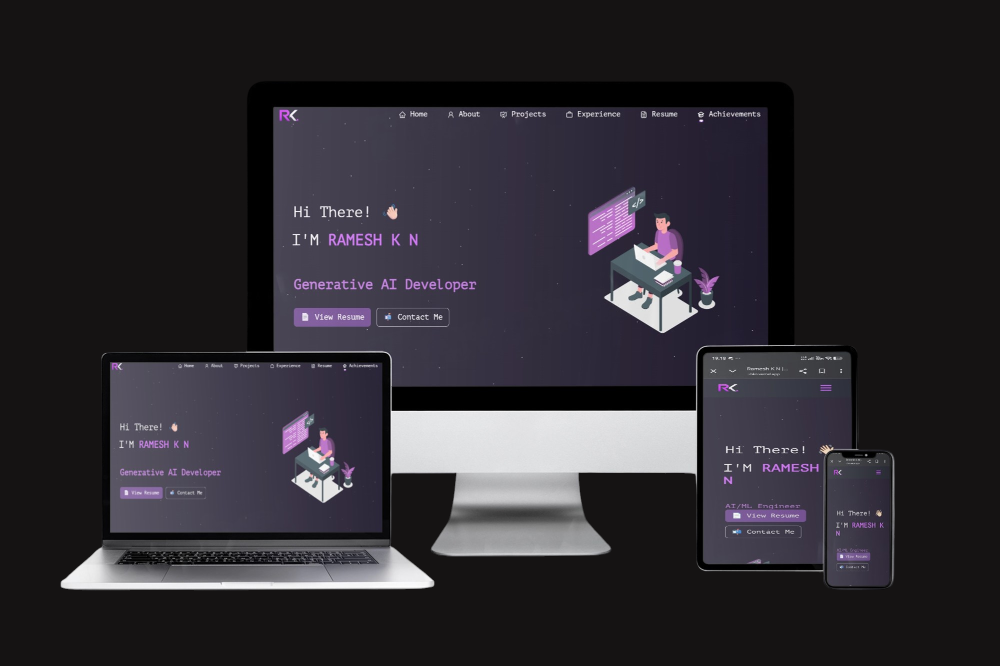

  

<h1 align="center">
Hi 👋 I'm Ramesh K N
</h1>

<h3 align="center">
AI/ML Engineer • Generative AI Developer • Full Stack Developer • Software Engineer
</h3>

---

# 🚀 Portfolio Website

### 🌐 Live Portfolio

### https://rameshkn.vercel.app

A modern developer portfolio built using **React.js** showcasing my:

- 🤖 AI & Machine Learning Projects
- 🚀 Generative AI Applications
- 💻 Full Stack Development
- 📚 Research Publications
- 📜 Patents
- 🏆 Certifications
- 💼 Internship Experience
- 📫 Contact Page

---

# 👨‍💻 About Me

🎓 Bachelor of Engineering (Artificial Intelligence & Machine Learning)

🏫 CMR Institute of Technology, Bengaluru

💼 Android App Developer using GenAI Intern @ MindMatrixEd

💡 Passionate about building AI-powered software solutions using Machine Learning, Generative AI, Large Language Models and Full Stack technologies.

---

# 🛠 Tech Stack

### Programming Languages

- Python
- Java
- C++
- JavaScript
- SQL

### Artificial Intelligence

- Machine Learning
- Deep Learning
- TensorFlow
- PyTorch
- OpenCV
- YOLOv8
- LangChain
- RAG
- Large Language Models

### Web Development

- React.js
- FastAPI
- Node.js
- Express.js
- HTML
- CSS
- Bootstrap

### Database

- MySQL
- PostgreSQL
- SQLite
- Firebase

### Cloud

- Oracle Cloud Infrastructure
- GitHub
- Vercel

---

# ⭐ Featured Projects

## ⚖️ LexCounsel AI

AI-powered Legal Assistant using

- Generative AI
- Retrieval-Augmented Generation (RAG)
- LangChain
- Vector Database
- Large Language Models

🌐 Live Demo

https://lexcounsel-ai.vercel.app

---

## 🔋 EV Battery Copilot

Battery Intelligence Platform

- Battery Health Prediction
- Remaining Useful Life Prediction
- Charging Analytics
- Trip Planning
- ML Forecasting

---

## 🏝 Multi-Agent Tourism System

AI-powered intelligent tourism recommendation system using multiple autonomous agents.

---

## 🌾 GramaUrja

Android application developed during my internship for Smart Village Power Monitoring and Energy Analytics.

---

## 🚦 Smart Traffic Management System

AI-based intelligent traffic congestion monitoring and adaptive signal optimization.

---

# 📚 Publications

📄 AI Copilot for Electric Vehicle Battery Health Prediction and Management

---

# 📜 Patents

- AI-Powered Intelligent Pet Health Monitoring and Behavioral Anomaly Detection System
- A Position Sensor-Based System and Method for Real-Time Mouse Pointer Trackin

---

# 🏆 Certifications

- Oracle Cloud Infrastructure 2025 AI Foundations Associate
- Oracle Cloud Infrastructure 2025 Generative AI Professional
- Salesforce Agentforce Trailhead
- Wipro Data Science
- HP AI for Beginners
- CMRIT COE Artificial Intelligence Certification
- ToughTongue AI Coding Challenge Finalist

---

# 📫 Connect With Me

🌐 Portfolio

https://rameshkn.vercel.app

📧 Email

rameshkn2004@gmail.com

💼 LinkedIn

https://www.linkedin.com/in/ramesh-kn/

💻 GitHub

https://github.com/Rameshkn04

🧩 LeetCode

https://leetcode.com/u/RameshKN04/

☁ Salesforce Trailhead

https://www.salesforce.com/trailblazer/rameshkn04

---

### ⭐ If you like this project, don't forget to leave a star!

Made with ❤️ by **Ramesh K N**

